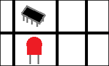
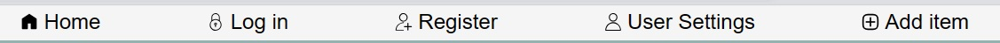
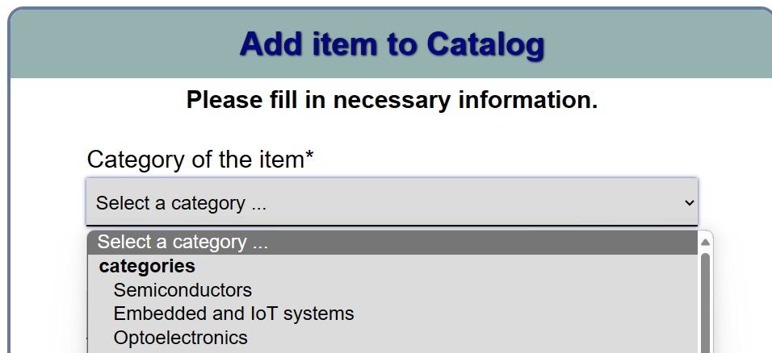
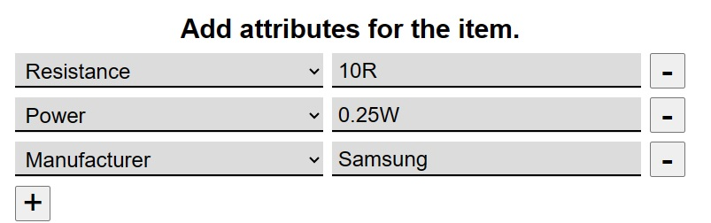
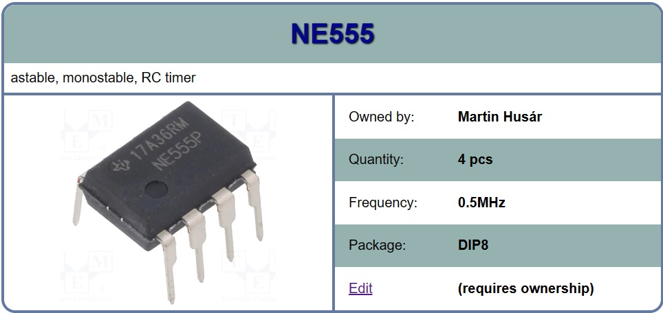
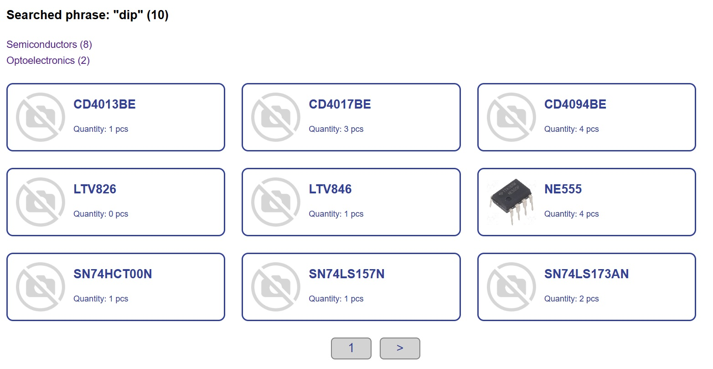

# Electronic parts database

## Table of Contents

- [Overview](#overview)
- [Getting Started](#getting-started)
  - [Creating an account](#creating-an-account)
- [Usage](#usage)
  - [Adding item](#adding-item)
  - [Editing item](#editing-item)
  - [Deleting item](#deleting-item)
  - [Search](#search)
- [Documentation](#documentation)

## Overview

Electronic parts database is a website for storing editing and viewing electronic parts you have at home. User can create an account and then add and manage his parts.

Parts of all users can be viewed publicly. This aspect can be useful in managing team of people because you no longer have to ask if someone has the part in their home or inventory.

## Features

- **User Authentication:** Securely create an account.
- **Intuitive Dashboard:** Easily navigate through your parts collection using a user-friendly dashboard.
- **Add and Edit Parts:** Add new electronic parts, and edit or update existing entries with ease.
- **Categorization:** Organize your parts into categories for better classification.
- **Attributes:** Record detailed attributes for each part, such as resistance, voltage, and power.
- **Search and Categories:** Quickly locate specific parts using search and category functionalities.

## Getting Started

### Creating an account

To create an account (register) simply visit "Register" in top bar on the page.

Once there, you will be prompted to enter your first and last name, login and password.
Login must be unique, and must include at least one letter and one digit. Same goes for password.

Once you create an account you will be able to access all of the features.

## Usage

### Adding item

Please note that account is required to add item to the database.
The process of adding item is as follows:

1. **navigate to the "Add item" link on top bar of the page**
   You will be greeted by form to add item to catalog.
2. **select category**
   of the item from drop-down menu. Only these categories are valid and be accepted.

   
3. **write item name**
   This is the name the item will be presented with, it will also be used for search.
4. **write item description**
   Brief description enhances the search for the item.
5. **set item quantity**
   Specify how many of the parts do you have, if you don't have any, but want to add the item you can specify the quantity to be 0.
6. **upload image** (optional)
   This step is not mandatory, but if you want your item to be presented with pretty and relevant picture, you can upload it. Please note only valid and accepted formats are .png and .jpg/.jpeg.
7. **add attributes** (optional)
   Here you can add attributes like voltage, resistance, manufacturer, etc.
   To add an attribute click on the "+" button and select an attribute from the drop-down menu, then write value of the attribute. Please note only attributes with correctly selected attribute and inputted value will be accepted.
   
8. **add item**
   When you are happy with the item you can add it to the database. Don't worry, you can change any of these informations anytime.
   After adding the item you will be redirected to details page with this item.

### Editing item

To edit an item, you can click on "edit" link in details page of the item you want to edit. Please note you need to be owner of that item and logged-in.

### Deleting item

Deleting item is possible from item edit page. To delete an item you can use the "detete item" button.

### Search

Main page provides user with easy access to categories that divide item into many groups. However, when more precise lookup is neccesary, there is an search function for that.

To search an item use the search bar in the top. You need to input at least 2 characters. The search algorithm works by matching the whole string, not individual words, bear that in mind when searching specific parts. Search is not case-sensitive.

After searching you can select browse the pages, click on the item that you want to view its details or select the category to narrow down your search. 

Search shows you how many items were found and next to the categories is present number of matches within that category, in brackets.

## Documentation

[Automatically generated (phpdoc)](https://zwa.toad.cz/~husarma1/docs/api/index.html)

[Programmer documentation](docs/README.md)
