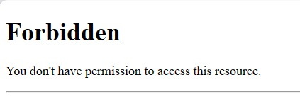
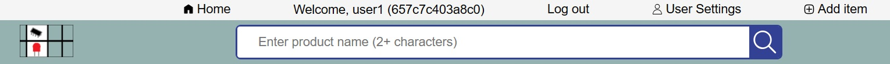
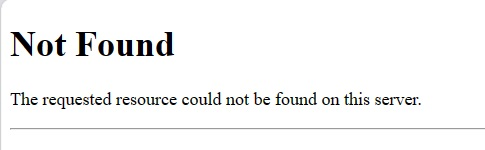
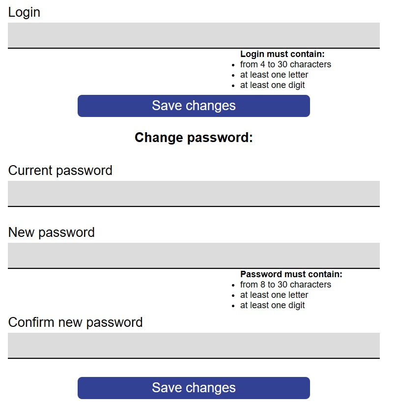

# Programmer documentation

This is a programmer documentation of Electronic parts database project. Here is shown the architecture of the project and basic overview of the source code.

The project is created using MVC front-controller architecture.

* **Model:** interacting with database, in this case managing the users and items.
* **View:** rendering the webpage, using Mustache template engine
* **Controller:** managing data received from user and directing it to model and/or view accordingly

## Table of contents

* [Model](#model)
  * [Users](#users)
  * [Items](#items)
  * [Categories](#categories)
  * [Attributes](#attributes)
* [View](#view)
  * [Footer](#footer)
  * [Forbidden](#forbidden)
  * [Header](#header)
  * [Index view](#index)
  * [Add item](#add-item)
  * [Item details](#item-details)
  * [Item edit](#item-edit)
  * [Katalog view](#katalog-view)
  * [Login view](#login-view)
  * [Not found](#not-found)
  * [Register view](#register-view)
  * [User settings view](#user-settings-view)
* [Front controller](#front-controller)
* [Page controllers](#page-controllers)
  * [Check controller](#check-controller)
  * [Docs controller](#docs-controller)
  * [Index controller](#index-controller)
  * [Item controller](#item-controller)
  * [Katalog controller](#katalog-controller)
  * [Login controller](#login-controller)
  * [Logout controller](#logout-controller)
  * [Register controller](#register-controller)
  * [User settings controller](#user-settings-controller)

## Model

### Users

Model [users](../models/users.php) is used to interact with user database. It contains functions to add,edit and remove user as well as function to return list of all users. It works with `users.json` file as database.

#### Functions overview

##### `listUsers()`

Reads database file and returns decoded json as list of all users as `array` with all of their values.

```php
function listUsers()
{
    $str = file_get_contents("db/users.json");
    return json_decode($str, true);
}
```

##### `existsUser($login)`

Checks whether user with this login exists or not. This is done by linearly scanning through list of users and comparing login values. Returns `true` if user with this login exists, `false `if this login has not been used yet.
Login to compare against is provided in argument `$login`.

```php
function existsUser($login)
{
    foreach (listUsers() as &$user) {
        if ($user["login"] == $login) {
            return true;
        }
    }
    return false;
}
```

##### `getUserByLogin($login)`

Goes through list of users and returns object of user whose login value is matching `$login`. If user with this login does not exist, returns `null.`

```php
function getUserByLogin($login)
{
    foreach (listUsers() as &$user) {
        if ($user["login"] == $login) {
            return $user;
        }
    }
}
```

##### `getUser($id)`

An alternative to `getUserByLogin()` with only difference being search for matching id.
Returns object of `$user` if found match, if not returns `null`.

```php
function getUser($id)
{
    foreach (listUsers() as &$user) {
        if ($user["id"] == $id) {
            return $user;
        }
    }
}
```

##### `saveUsers()`

Using `json_encode()` encodes the list of users provided in `$users` argument and saves it into database.

```php
function saveUsers($users)
{
    $str = json_encode($users);
    file_put_contents("db/users.json", $str);
}
```

##### `addUser($fName, $lName, $login, $password, $id = null)`

Adds user into database, required parameters are first name (`$fName`), last name (`$lName`), login (`$login`) and password hash `$password`. Optionally, users id can be specified, otherwise it will be created using `uniqid()` function. All arguments are then assembled into `$user` object, added to the list of all users and subsequently saved into the database. Function returns id of the newly created user.

**! This function does not perform password hashing, it needs to be done beforehand.**

```php
function addUser($fName, $lName, $login, $password, $id = null)
{
    $all = listUsers();
    if (!$id) {
        $id = uniqid();
    }
    $user = ["id" => $id, "fName" => $fName, "lName" => $lName, "login" => $login, "password" => $password];
    $all[] = $user;
    saveUsers($all);
    return $id;
}
```

##### `deleteUser($id)`

Goes through list of all user, removes user with id matching `$id` and updates the database.

```php
function deleteUser($id)
{
    $all = listUsers();
    foreach ($all as $key => &$user) {
        if ($user["id"] == $id) {
            unset($all[$key]);
            saveUsers($all);
            return;
        }
    }
}
```

##### `editUser($user)`

Finds user object in list of all users with id matching `$user["id"]` and replaces that instance with the one provided in argument. Updates database afterwards.

```php
function editUser($user)
{
    $all = listUsers();
    foreach ($all as &$value) {
        if ($value["id"] == $user["id"]) {
            $value = $user;
            saveUsers($all);
            return;
        }
    }
}
```

### Items

Model [items](../models/items.php) is used to interact with items database. It contains functions to add,edit and remove item as well as function to return list of all items. It works with `items.json` file as database. Both users and items models are designed simmilarly to ease workflow.

#### Functions overview

##### `listItems()`

Reads database file and returns decoded json as list of all items as `array` with all of their values.

```php
function listItems()
{
    $str = file_get_contents("/home/husarma1/www/db/items.json");
    return json_decode($str, true);
}
```

##### `getItem($id)`

Goes through list of items and returns object of item whose id value is matching `$id` parameter. If item with this id does not exist, returns `null.`

```php
function getItem($id)
{
    foreach (listItems() as &$item) {
        if ($item["id"] == $id) {
            return $item;
        }
    }
}
```

##### `saveItems($items)`

Using `json_encode()` encodes the list of items provided in `$items` argument and saves it into database file.

```php
function saveItems($items)
{
    $str = json_encode($items);
    file_put_contents("/home/husarma1/www/db/items.json", $str);
}
```

##### `addItem($name, $owner, $category, $quantity, $description, $attributes = [], $imageFormat = "")`

Adds item into database, required parameters are `$name` of the item, items `$owner` (id of user who added this item), `$category` of the item (one from available [categories](../private/categories.json)), numeric item's `$quantity`, and short `$description` of the item. Optional arguments are `$attributes` of the item (`array` of `attribute="attribute"` and `value="value"` pairs) and `$imageFormat` of the item's image (file extension of the image that represents this item).

```php
function addItem($name, $owner, $category, $quantity, $description, $attributes = [], $imageFormat = "")
{
    $all = listItems();
    $id = uniqid();
    $item = [
        "id" => $id,
        "owner" => $owner,
        "name" => $name,
        "category" => $category,
        "quantity" => $quantity,
        "description" => $description,
        "attributes" => $attributes,
        "imageFormat" => $imageFormat
    ];
    $all[] = $item;
    saveItems($all);
    return $id;
}
```

##### `deleteItem($id)`

Goes through list of all items, removes item with id matching `$id` and updates the database.

```php
function deleteItem($id)
{
    $all = listItems();
    foreach ($all as $key => &$item) {
        if ($item["id"] == $id) {
            unset($all[$key]);
            saveItems($all);
            return;
        }
    }
}
```

##### `editItem($item)`

Finds item object in list of all items with id matching `$item["id"]` and replaces that instance with the one provided in argument. Updates database afterwards.

```php
function editItem($item)
{
    $all = listItems();
    foreach ($all as &$value) {
        if ($value["id"] == $item["id"]) {
            $value = $item;
            saveItems($all);
            return;
        }
    }
}
```

### Categories

Provides list of categories from [categories.json](../private/categories.json) file.

#### Functions overview

##### `getCategories()`

Reads file and returns decoded json as list of all categories.

```php
function getCategories()
{
    $str = file_get_contents("private/categories.json");
    return json_decode($str, true);
}
```

### Attributes

Provides list of attributes from [attributes.json](../private/attributes.json) file.

#### Functions overview

##### `getAttributes()`

Reads file and returns decoded json as list of all attributes.

```php
function getAttributes()
{
    $str = file_get_contents("private/attributes.json");
    return json_decode($str, true);
}
```

## View

Views are utilizing mustache template engine. Each controller has one or more views, depending on needs. Generally, the view takes `$data` argument from controller and renders page based on it.

Header and footer are preppended and appended to every view in its corresponding [page controller](#page-controllers).

### Footer

[Footer](../views/footer.mustache) is used across all pages. It contains useful links.

footer example:


### Forbidden

Forbidden page is shown when user tries to access resource forbidden for him, for example editing item he is not owner of.

User tried to edit item he is not owner of:



### Header

[Header](../views/header.mustache) is used across all pages, it incorporates navigation menu and search-bar.

Based on the `"user"` value in `data` it changes the appearance of navigation links, if the `"user"` is not set, that means he is not logged in, so **Register** and **Log in** options are shown. If the `"user"` is set options **Log out** and **User Settings** options are shown instead. Title of the document is set as `title` variable set in controller.

example of header after user has logged in:



Header utilizes [search script](../public/js/search.js). It's purpose is to show 'X' button when text is inputted into search field by user. Upon clicking on this button, the field is reset. whti JavaScript disabled, the button is shown permanently so it still functions the user

[search.js script](../public/js/search.js):

```js
document.addEventListener("DOMContentLoaded", function () { // included in header.mustache need for wait until DOM is loaded
    document.querySelector(`.search-container>input[type="text"]`).addEventListener("input", showClear); // show clear button when text is inputted

    const searchClear = document.querySelector(`.search-container>button[type="reset"]`);
    searchClear.addEventListener("click", clearSearch);
    searchClear.children[0].classList.add("hidden"); // hide it on page load (it stays visible with JS disabled)
});
// show button to clear search field
function showClear(e) {
    const searchClear = document.querySelector(`.search-container>button[type="reset"]`);
    if (e.target.value.length > 0) {
        searchClear.children[0].classList.remove("hidden");
    } else {
        searchClear.children[0].classList.add("hidden");
    }
}
// hide button to clear search field after it has been clicked
function clearSearch(e) {
    e.currentTarget.children[0].classList.add("hidden");
}
```

### Index view

[Index](../views/index.mustache) is main page. It displays all categories as links used to search items in those categories. Each category has its own svg icon linked.

```php-template
<ul class="categories">
    {{#categoryList}}
        <li>
            <a href="/~husarma1/katalog/?category={{category}}">
                <svg class="svg-icon" viewBox="0 0 50 50" data-is-empty="false">
                <use xlink:href="/~husarma1/public/svg/categories/{{category}}.svg#{{category}}-svg"></use>
                </svg>
                <p>{{label}}</p>
            </a>
        </li>
    {{/categoryList}}
</ul>
```

### Add item

[Add item (itemAdd)](../views/itemAdd.mustache) renders form for adding an item. If provided data is pre-filled into the form inputs. If any notices or errors were set, they are shown and styles (classes) are changed accordingly. It used [itemAddValidation script](../public/js/itemAddValidation.js) to check validation on client-side.

```js
function validateItem(e) {
    if (validate) {
        if (category.value != 0) {
            validationStyle("", false, category.nextElementSibling, category)
        } else {
            validationStyle("This field is obligatory.", false, category.nextElementSibling, category)
            e.preventDefault();
            window.scrollTo(0, 0);
        }
```

Additionally [filePreview script](../public/js/filePreview.js) is used to interactively show user preview of the to-be uploaded file also with the file size. It is used to perform file format validation too.

```js
function updateImageDisplay(e) {
    const image = e.target.nextElementSibling;

    if (e.target.files.length > 0) {
        const file = e.target.files[0];
        if (validTypeImage(file)) {
            image.src = URL.createObjectURL(file);
            image.alt = image.title = file.name;
            image.nextElementSibling.innerHTML = `File size: ${returnFileSize(
                file.size,
            )}.`;
            image.nextElementSibling.classList.remove("incorrectText");
        } else {
            image.nextElementSibling.innerHTML = `File name ${file.name}: Not a valid file type.`;
            image.nextElementSibling.classList.add("incorrectText");
        }
    }
}
```

### Item details

[Item details (itemDetails)](../views/itemDetails.mustache) renders details about an item. Name, description and quantity are shown, together with attributes of the item. If specified, item's image is shown, otherwise [no image](../public/images/noImage.png) is used.

### Item edit

[Item edit (itemEdit)](../views/itemEdit.mustache) renders form for adding an item. If provided data is pre-filled into the form inputs. If any notices or errors were set, they are shown and styles (classes) are changed accordingly. It is made simmilarly to **Add item** view with most notable differences being different labels and description text along with extra button to delete item. Item edit uses same [addItemValidation script](../public/js/itemAddValidation.js) and [filePreview script](../public/js/filePreview.js) as[ add item](#add-item).

```js
function validateItem(e) {
    if (validate) {
        if (category.value != 0) {
            validationStyle("", false, category.nextElementSibling, category)
        } else {
            validationStyle("This field is obligatory.", false, category.nextElementSibling, category)
            e.preventDefault();
            window.scrollTo(0, 0);
        }
```

Variable `validate` is used to perform validation, when **delete item** button is clicked, it is set to `false`, since when deleting an item, validation is not neccessary.

```js
const deleteItem = document.querySelector(`main form input[name="delete"]`)

if (deleteItem) {
    deleteItem.addEventListener("click", noValidate);
}

let validate = true;
function noValidate() {
    // delete item, no need for validation
    validate = false;
}
```

### Katalog view

[Katalog](../views/katalog.mustache) view shows items from search result. Items are organized in a grid and showed with links to the items details page, items name, quantity and image if item has one.

Example of iteratively goint through list of items and creating `<li>` for each one of them.

```php-template
{{#listItems}}
    <li>
        <a href="/~husarma1/item/details/?id={{item.id}}">
            {{#item.imageFormat}}
                
            {{/item.imageFormat}}
            {{^item.imageFormat}}
                
            {{/item.imageFormat}}
            <p>{{item.name}}</p>
            <p>Quantity: {{item.quantity}} pcs</p>
        </a>
    </li>
{{/listItems}}
```

### Login view

[Login](../views/login.mustache) view shows login form. In case of an unsucessful attempt displays error messages accordingly.

Example of handling login input field. If incorrect is set by controller (invalid login) the input field is rendered with **incorrectText** class with its **notice** with **incorrectText** class.

```php-template
{{^login.incorrect}}
    <input type="text" name="{{login.name}}" id="{{login.name}}" {{#login.value}}value="{{login.value}}"{{/login.value}}>
    <p class="correctText">{{login.notice}}</p>
{{/login.incorrect}}
{{#login.incorrect}}
    <input type="text" name="{{login.name}}" id="{{login.name}}" class="incorrectInput" {{#login.value}}value="{{login.value}}"{{/login.value}}>
    <p class="incorrectText">{{login.notice}}</p>
{{/login.incorrect}}
```

Login uses[ loginValidation script](../public/js/loginValidation.js) to check whethe value is or is not present in input fields on client-side.

[loginValidation.js script:](../public/js/loginValidation.js)

```js
// get input fields
const login = document.querySelector(`main form input[type="text"]`)
const password = document.querySelector(`main form input[type="password"]`)
const form = document.querySelector("main form")

// add event listeners
login.addEventListener("input", removeValidationStyle);
password.addEventListener("input", removeValidationStyle);
form.addEventListener("submit", validateLogin);

function validateLogin(e) {
    if (login.value) {
        validationStyle("", false, login.nextElementSibling, login) // valid so no notice and basic style
    } else {
        validationStyle("This field is obligatory.", false, login.nextElementSibling, login)
        e.preventDefault();
    }

    if (password.value) {
        validationStyle("", false, password.nextElementSibling, password) // valid so no notice and basic style
    } else {
        validationStyle("This field is obligatory.", false, password.nextElementSibling, password)
        e.preventDefault();
    }
}
```

### Not found

Not found page is used to inform user that requested resource could not be found on the server, for example when user tries to view details of item which does not exist (non-existent id).

User tried to view item which does not exist:



### Register view

[Register](../views/register.mustache) form shows user all input fields needed for [user](#users) account creation/registration. Simmilarly to other views containing user forms it handles pre-filling the fields with correct or incorrect data, changing styles according to data validity and display of error notices to the user. All fields are pre-filled on unsucessful submit with the exception of password fields.

Password field example, note no `value=""` assign for safety reasons.

```php-template
{{^password.incorrect}}
    <input type="password" name="{{password.name}}" id="{{password.name}}">
    <p class="correctText">{{password.notice}}</p>
{{/password.incorrect}}
{{#password.incorrect}}
    <input type="password" name="{{password.name}}" id="{{password.name}}" class="incorrectInput">
    <p class="incorrectText">{{password.notice}}</p>
{{/password.incorrect}}
```

Register uses registerValidation script. It checks if input fields are empty, disabling form send if true. It also checks if user login is already used or not with `fetch()` which is handled by [check controller](#check) in server side.

```js
const response = await fetch(`https://zwa.toad.cz/~husarma1/check/loginExists/?login=${encodeURIComponent(e.target.value)}`, { mode: 'no-cors' });
const exists = await response.json();

if (exists) {
    isValid = false;
    notice = "Username already in use."
} else {
    notice = "Username available.";
}
```

Requirement for password and/or login lenght and inclusion of at least one character and digit is validated with `validateInput()` function. It returns notice if any was generated along with boolean value if the input is valid or not.

```js
function validate_input(input, minLength, maxLength, name = "") {
    // Check length
    length = input.length;
    if (length < minLength) {
        return [name + " must be longer than " + minLength + " characters.", false];
    }
    if (length > maxLength) {
        return [name + " must be shorter than " + maxLength + " characters.", false];
    }

    // Check for at least one letter and one digit using regular expressions
    if (!input.match(/[A-Za-z]/)) {
        return [name + " must contain at least one letter.", false];
    }

    if (!input.match(/[0-9]/)) {
        return [name + " must contain at least one digit.", false];
    }

    // If all conditions are met, the password is valid
    return [name + " is valid.", true];
}
```

### User settings view

User settings show form simmilar to [register](#register) for updating user's account. It pre-fills the fields with already saved data. Most notable change compared to [register](#register) form is the inclusion of second submit button and current password field, used to change user's password.



User settings view [user userSettingsValidation script](../public/js/userSettingsValidation.js). It is responsible for checking input field (login, password) criteria. Only exception is checking current password, that is controlled on server side by comparing it to **hash** of the current one stored in the database.

Javascript also checks input fields which are dependent on each other, in this case password and password2 which must be the same.

```js
const noticeElem = e.target.nextElementSibling;
let notice, isValid;

const password_field = document.querySelector(`input[name="password"]`);
if (password_field.value == e.target.value) {
    isValid = true;
    notice = "Passwords match";
} else {
    isValid = false;
    notice = "Passwords do not match";
}
validationStyle(notice, isValid, e.target.nextElementSibling, e.target);
```

## Front controller

[Front controller ](../index.php)is responsible for delegating which page controller and function should be used.

### Basic overview

1. Using the [uri libs](../libs/uri_libs.php) library convert uri string to array of arguments.
   ```php
   $params = $_GET["params"];
   $todo = (parseUri($params)); // convert parameters to array
   ```
2. First argument is used to pick page controller, whether it exists or not is checked using `file_exists()` function. If the file exists it is included.
   ```php
   if (file_exists($action_controller)) {
       include($action_controller);
   ```
3. Second argument is used to pick function within page controller picked previously, whether it exists or not is checked using `function_exists()` function. If the function exists it is called.
   ```php
   if (function_exists($todo[1])) {
       $todo[1]();
   ```

If any of controller or functions do not exists the front controller reports the error.

```php
...
else {  
    echo ("Non existing action controller <b>" . htmlspecialchars($todo[0]) . "</b> called.");
    exit();
}
```

## Page controllers

Page controllers handle individual pages. They are responsible for validating the forms, communicating with model and creation of data for view to render.

### Controllers:

* [Check controller](#check-controller)
* [Docs controller](#docs-controller)
* [Index controller](#index-controller)
* [Item controller](#item-controller)
* [Katalog controller](#katalog-controller)
* [Login controller](#login-controller)
* [Logout controller](#logout-controller)
* [Register controller](#register-controller)
* [User settings controller](#user-settings-controller)

---

### Check controller

[Check controller](../controllers/check.php) is not intended for interaction with user. Its primary use is for JavaScript requests.

#### `basic()`

Basic function only redirects the user to the main page.

#### `loginExists()`

Function `loginExists()` expects parameter "login" in GET request. It then queries the users model to check if user with this login exists already. It returns `true` or `false` depending on the result.

### Docs controller

[Docs controller](../controllers/docs.php) is used to correctly redirect user to automatically generated documentation hosted on the same domain. This is needed due to the nature of how the front-controller setup of this project works

### Index controller

[Index controller](../controllers/index.php) is a main page controller. It requests the categories list from [categories ](#categories)model and pases them to the [index view](#index-view) (launches mustache template engine). It contains only `basic()` function.

#### `basic()`

```php
function basic()
{
    $data = [];
    $data["title"] = "Main page";

    if (isset($_SESSION["id"])) {
        $data["user"] = getUser($_SESSION["id"]);
    }
    $data["categoryList"] = getCategories();

    $template = file_get_contents('views/header.mustache') . file_get_contents('views/index.mustache') . file_get_contents('views/footer.mustache');
    $mustache = new \Mustache_Engine(array('entity_flags' => ENT_QUOTES));
    echo $mustache->render($template, $data);
}
```

Function first initiates the `$data` variable, sets the `"title"` property (title of the document). If user is logged-in, retrieves `user` object of logged-in user. Category list is returned from [categories model](#categories) function `getCategories()`. Variable `$data` is then passed to mustache engine which uses [header](#header) combined with [index](#index-view) and [footer](#footer) views. Mustache template is then rendered. Simmilar rendering principle is then utilized in other [page controllers](#page-controllers).

### Item controller

[Item controller](../controllers/item.php) handles showing details of the item, adding item and editing item.

#### `basic()`

Redirects user to main page.

#### `common()`

Since form in[ add item view](#add-item) and [edit item view](#edit-item) are simmilar, common function for getting data from request and validation is used, all other specific tasks are handled in `add()` and `edit()` functions respectively. Function sets all data into `$data` variable which is returned and later passed to respective view.

For data fields `formInput` class is used.

```php
...
$data["description"] = new formInput("description");
...
```

For validation `getInput()` method of `formInput` class is used. This class sets the `incorrect` and `notice` properties depending on input. Specific validation like length and inclusion of character and/or digit is handled in `common()` or `add()` and `edit()` functions.

```php
...
$data["description"]->getInput();
...
```

#### `add()`

Function add handles adding item to the list of items (database). It uses the `basic()` function to get values from request. After `basic()` returns values, validity is checked. If every input field is valid, function proceeds to send the information to corresponding model. Othervise, the view is rendered again with pre-filled data and notices coming from validation.

Check for validity:

```php
if (
    isset($_POST["submit"])
    && !isset($data["category"]->incorrect)
    && !isset($data["name"]->incorrect)
    && !isset($data["description"]->incorrect)
    && !isset($data["quantity"]->incorrect)
    && !isset($data["file"]->incorrect)
) {
```

Function also handles saving of the image. Before saving, each image is **cropped** and **resized**. Name of the image is same as **id** of the item, format is saved in item's `imageFormat `property.

```php
// Path to save the uploaded image
$targetPath = "public/images/" . $id . "." . $fmt;

// Move the uploaded file to the target path
move_uploaded_file($_FILES["image"]["tmp_name"], $targetPath);
// Load the original image
if ($fmt == "jpg" || $fmt == "jpeg") {
    $originalImage = imagecreatefromjpeg($targetPath);
} elseif ($fmt == "png") {
    $originalImage = imagecreatefrompng($targetPath);
}

// Get the original image dimensions
$originalWidth = imagesx($originalImage);
$originalHeight = imagesy($originalImage);

// Determine the crop size to achieve a 1:1 ratio
$cropSize = min($originalWidth, $originalHeight);

// Calculate the crop position for center alignment
$cropX = ($originalWidth - $cropSize) / 2;
$cropY = ($originalHeight - $cropSize) / 2;

// Create a new image with the desired size
$newWidth = $newHeight = 500;
$newImage = imagecreatetruecolor($newWidth, $newHeight);

// Crop and resize the image
imagecopyresampled($newImage, $originalImage, 0, 0, $cropX, $cropY, $newWidth, $newHeight, $cropSize, $cropSize);

// Save the resized and cropped image back to the target path
if ($fmt == "jpg" || $fmt == "jpeg") {
    imagejpeg($newImage, $targetPath, 90); // Adjust quality as needed
} elseif ($fmt == "png") {
    imagepng($newImage, $targetPath, 9); // Adjust compression level as needed
}


// Free up memory
imagedestroy($originalImage);
imagedestroy($newImage);
```

Example of sending data to create item to model:

```php
$id = addItem($data["name"]->value, $_SESSION["id"], $data["category"]->value, $data["quantity"]->value, $data["description"]->value, ((isset($itemAttrs)) ? $itemAttrs : []), $fmt);
```

After the item is added, the user is redirected to details page for that item.

```php
header("location: /~husarma1/item/details/?id=" . $id); // redirect user to page with newly created item
die();
```

#### `edit()`

Edit function works simmilar to add function,that is calls `common()` function to get and validate data. In case of every field valid, it calls the model to edit the item:

```php
$item["name"] = $data["name"]->value;
$item["category"] = $data["category"]->value;
$item["quantity"] = $data["quantity"]->value;
$item["description"] = $data["description"]->value;
if (isset($itemAttrs)) {
    $item["attributes"] = $itemAttrs;
}
$item["imageFormat"] = $fmt;

editItem($item);
```

Check whether attributes `$itemAttrs` are set is performed because this input is optional and might and can be `null`.

Function also saves image with all editing done as in `add()` function with extra step of deleting previous image if it existed. This step exists because new image might not be the same format and thus would not be overwritten (the name stays the same which is item's id).

```php
if ($item["imageFormat"]) {
    unlink(("public/images/" . $item["id"] . "." . $item["imageFormat"])); // remove old image
}
```

Edit function also provides ability to delete an item, which is detected by set `"delete"` value in request. After deleting the item, user is reditected to main page.

```php
if (isset($_POST["delete"])) {
    // delete item
    if ($item["imageFormat"]) {
        unlink(("public/images/" . $item["id"] . "." . $item["imageFormat"]));
    }
    deleteItem($item["id"]);
    header("location: /~husarma1/");
    die();
}
```

#### `details()`

Function `details` is used to retrieve details of item which is specified in request by `id`. If no `id` is specified, the user is redirected to main page. If `id` which does not correspond to any of the items in database is specified, the user is presented with [not found page](#not-found). Details page also orderd the item attributes in an order as is in [attributes](#attributes) database.

```php
// replace attribute names with attribute labels
// and make them correct order (like in .json file)
foreach (json_decode(file_get_contents('private/attributes.json'), true) as $group) {
    foreach ($group as $attribute => $label) {
        foreach ($item["attributes"] as $index => $attr) {
            if ($attribute == $attr["attribute"]) {
                $attrs[] = ["attribute" => $label, "value" => $attr["value"]];
            }
        }
    }
}
if (isset($attrs)) {
    $item["attributes"] = $attrs;
}

$data = [];
$data["item"] = $item;
$data["title"] = $item["name"];

if (isset($_SESSION["id"])) {
    $data["user"] = getUser($_SESSION["id"]);
}

$owner = getUser($item["owner"]);
$data["owner"] = $owner;
```

Owner of the item is retrieved from `id` in `owner` property of `item` using `getUser()` function from [users model](#users).

#### `returnFileSize($bytes)`

Function which returns file size in bytes, used in `edit()` to show already uploaded image size. It is made to be consistent with file preview script which shows size of the image. Function automatically formats the size to closest unit.

```php
function returnFileSize($bytes)
{
    if ($bytes < 1024) {
        return $bytes .  " bytes";
    } else if ($bytes >= 1024 && $bytes < 1048576) {
        return round($bytes / 1024, 1) . " KB";
    } else if ($bytes >= 1048576) {
        return round($bytes / 1048576) . " MB";
    }
};
```

### Katalog controller

[Katalog controller](../controllers/katalog.php) is responsible for providing search and filter result.

#### `stringifyItem($object)`

Function used to combine properties and attributes of `item` object into one string, to be later used for match search. Function excludes some properties `["id", "owner", "imageFormat", "category", "quantity"]` since they are not relevant for search.

```php
function stringifyItem($object)
{
    $excluded = ["id", "owner", "imageFormat", "category", "quantity"];
    $values = [];
    foreach ($object as $key => $value) {
        if (!in_array($key, $excluded)) {
            if (is_array($value)) {
                foreach ($value as $attr) {
                    // only copy values, not attribute names
                    $values[] = $attr["value"];
                }
            } else {
                $values[] = $value;
            }
        }
    }
    return strtolower(implode(" ", $values));
}
```

#### `compareByName($a, $b)`

Function that returns `strcmp` of names of `item` objects `$a` and `$b`.

```php
function compareByName($a, $b)
{
    return strcmp($a['item']['name'], $b['item']['name']);
};
```

#### `basic()`

Function `basic()` retrieves (if set) search query and category and returns items that match those criteria. If query is set, only accept items which have wanted string in them after being passed to `stringifyItem()` function.

```php
// go through query if it is set
if (isset($_GET["q"])) {
    $data["q"] = $_GET["q"];
    $items = [];
    $q = strtolower($_GET["q"]);

    foreach (listItems() as &$item) {
        if (str_contains(stringifyItem($item), $q)) {
            $items[] = ["item" => $item]; // item matches the search, add
        }
    }
    if (sizeof($items) == 1) {
        // we found exactly 1 match, so jump right to it
        header("location: ../item/details/?id=" . $items[0]["item"]["id"]);
        die();
    }
}
```

For categories, if query search was performed already, remove items that do not match the category from list.

```php
// there was already an search
foreach ($items as $key => &$item) {
    // remove items with not matching category
    if ($_GET["category"] != $item["item"]["category"]) {
        array_splice($items, $key, 1);
    }
}
```

If no query search was done (searching through categories from main page) add all items with desired category to the list.

```php
// no search, just get all of the items from category
foreach (listItems() as &$item) {
    if ($_GET["category"] === $item["category"]) {
        $items[] = ["item" => $item];
    }
}
```

If no categories are set, get all categories that contain searched items show how items that match the search are distributed in those categories.

```php
// to create links to categories that have these items and show their count
$inCategorires = [];
foreach ($items as &$item) {
    if (isset($inCategorires[$item["item"]["category"]])) {
        $inCategorires[$item["item"]["category"]]++;
    } else {
        $inCategorires[$item["item"]["category"]] = 1;
    }
}
foreach (getCategories() as &$category) {
    // if we found items in that category
    if (isset($inCategorires[$category["category"]])) {
        // add it to array to show it
        $category["count"] = $inCategorires[$category["category"]];
        $data["inCategories"][] = $category;
    }
}
```

After items are searched, they are ordered aplhabetically.

```php
usort($items, "compareByName");
```

Paging is controlled by `"page"` value in request.

```php
if (isset($_GET["page"])) {
    $data["page"] = $_GET["page"];
    if ($data["page"] < 1) {
        // handle negative pages
        $data["page"] = 1;
    }
    $index = ($data["page"] - 1) * $perPage;
    $data["listItems"] = array_slice($items, $index, $perPage);
} else {
    $data["listItems"] = array_slice($items, 0, $perPage);
    $data["page"] = 1;
}

if ($data["page"] != 1) {
    $data["prevPage"] = $data["page"] - 1;
}
$data["maxPage"] = ceil(sizeof($items) / $perPage);
if ($data["page"] < $data["maxPage"]) {
    $data["nextPage"] = $data["page"] + 1;
}
```

### Login controller

[Login controller](../controllers/login.php) handles user login. Login status is saved using session with `id` saved in session correcponding to `id` of logged in user's account.

#### `basic()`

Gets form values from requests, validates correctness, whether user exists or not and whether password is correct or not.

```php
$login = new formInput("login");
$password = new formInput("password");

if (isset($_POST["submit"])) {
    if ($login->getInput()) {
        // check if the user exists
        $user = getUserByLogin($login->value);
        if (!isset($user)) {
            $login->incorrect = true;
            $login->notice = "This user does not exist.";
        }
    }

    if ($password->getInput() && isset($user)) {
        // if user extist, verify password
        if (password_verify($password->value, $user["password"])) {
            $_SESSION["id"] = $user["id"];
            if (isset($_COOKIE["afterLogin"])) {
                // if user comes from page that redirected him to login, return to that page
                header("location: " . $_COOKIE["afterLogin"]);
                setcookie("afterLogin", "", -1, "/");
            } else {
                header("location: ../");
            }
            die();
        } else {
            $password->incorrect = true;
            $password->notice = "Incorrect password.";
        }
    }
}
```

If user credentials are correct, sets the session and redirects the user. If `afterLogin` cookie containing url of page that redirected user to login is set, redirect user to that page, otherwise redirect user to main page.

### Logout controller

[Logout controller](../controllers/logout.php) does not have any view associated with it. It handles logout of user, that is destroying the session and redirecting user.

#### `basic()`

Destroys session. If `afterLogout` cookie is set, redirects user to url specified by that cookie, otherwise redirects user to main page. If user that is already logged out acceses this page, he is redirected to main page.

```php
unset($_SESSION["id"]);
// redirect user to main page
if (isset($_COOKIE["afterLogout"])) {
    // if user comes from page that redirected him to logout, return to that page
    header("location: " . $_COOKIE["afterLogout"]);
    setcookie("afterLogout", "", -1, "/");
} else {
    header("location: ../");
}
die();
```

### Register controller

[Register controller](../controllers/register.php) handles registration of the user. It receives data from request and upon validation, communicates with [user model](#users) and adds user.\

#### `basic()`

Reads values from request and validates them. If any error is detected, pre-filled data (except password) is returned to the user together with notice describing the error. If all inputs are valid, proceeds to account creation. For `login` and `password` the `validate_input()` function is used, it checks for input value length and whether it includes at least one character and at least one digit. In case of `login`, check whether this `login` is already used or not is also performed. In case of `password`, it is compared to `password2` (retype or confirm password field) if both match.

Example of validating login and password:

```php
if ($login->getInput()) {
    $login->notice = validate_input($login->value, 4, 30, "Login");
    if ($login->notice) {
        $login->incorrect = true;
    } else if (getUserByLogin($login->value)) {
        $login->incorrect = true;
        $login->notice = "Username already in use.";
    } else {
        $login->notice = "Username available.";
        $login->valid = true;
    }
}
if ($password->getInput()) {
    $password->notice = validate_input($password->value, 8, 30, "Password");
    if ($password->notice) {
        $password->incorrect = true;
    } else {
        $password->valid = true;
    }
}
```

Check if everything is valid, if yes, add new user:

```php
if (
    $fName->valid &&
    $lName->valid &&
    $login->valid &&
    $password->valid &&
    $password2->valid
) {
    $h = password_hash($password->value, PASSWORD_DEFAULT);
    $_SESSION["id"] = addUser($fName->value, $lName->value, $login->value, $h);
    // redirect user to main page
    header("location: ../");
    die();
}
```

If logged-in user tries to register, he is first redirected to [logout](#logout) with `afterLogout` cookie set to url of register controller. This automatically logouts the user and returns him back to register page.

```php
if (isset($_SESSION["id"])) {
    setcookie("afterLogout", "/~husarma1/" . basename(__FILE__, '.php') . "/", time() + 60 * 5, "/"); // 5 minute expiration
    header("location: /~husarma1/logout/");
    die();
}
```

### User settings controller

[User settings controller](../controllers/userSettings.php) handles requests to edit user information and credentials. The rules for input values are same as in [register controller](register-controller). On `GET` request to `basic()` function user's current data are pre-filled into the input fields (with exception of current password, since it is hashed).

#### `basic()`

Reads data from request and performs validation, each input is compared to current user's value, if it is different `$changesMade` variable is set.

```php
if (isset($_POST["submit"])) {
    $changesMade = false;
    if ($fName->getInput() && $fName->value != $user["fName"]) {
        $changesMade = true;
        $user["fName"] = $fName->value;
    }
```

If everything is valid and `$changesMade` is set edits the user information. If form is submitted and `$changesMade` is not set, user is redirected to main page without editing information since no changes were made.

```php
if (
    !isset($fName->incorrect)
    && !isset($lName->incorrect)
    && !isset($login->incorrect)
    && !isset($passwordCur->incorrect)
    && !isset($password->incorrect)
    && !isset($password2->incorrect)
) {
    if ($changesMade) {
        editUser($user);
    }
    header("location: /~husarma1/");
    die();
}
```

Change of password is initiated only if each of  the 3 password fields (current password, new password, confirm new password) are valid. If more than one but not all 3 are missing an value or are incorrect, validation of those fields is issued. If all 3 are without value, the user edit proceeds without change to the password or validation of empty password fields.
